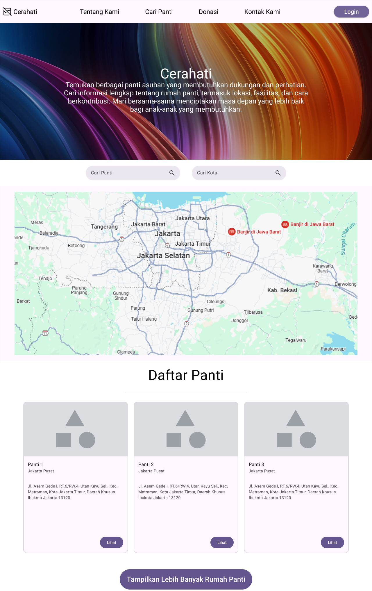
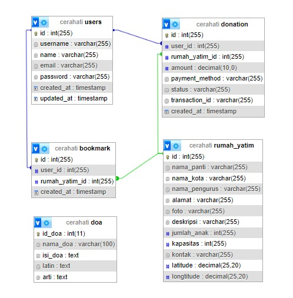

# Kelompok 9 SoA

## Case

Portal Rumah Yatim

## Nama Aplikasi

Cerahati

## Tentang Cerahati

Cerahati adalah portal digital yang menghubungkan panti asuhan dengan masyarakat yang ingin berbagi dan peduli. Melalui Cerahati, kamu dapat menemukan informasi lengkap tentang berbagai panti asuhan, mulai dari lokasi, jumlah anak asuh, hingga fasilitasnya. 

## Anggota

Dafa Andika Firmansyah - 2210511049  
Farel Bayhaqi - 2210511073  
Putra Mahandika - 2110511047  

## Summary Of Features

| Feature | Status |
|---------|---------|
| API Sederhana | 25 API Endpoints |
| API Kompleks | 15 API Endpoints |
| API NoSQL (Redis) | 14 API Endpoints |
| Database | MySQL |
| Documentation | Inline & README |

## Website sejenis

- **kapilerindonesia**
- **pantiyatim**

## Front-End

[Cerahati Website Repository](https://github.com/zerrr232/SOA-Kel.9_Rumah-yatim)

## Mockup Halaman Utama



## ERD



## Installation

1. Clone repository:
```bash
git clone [URL_REPOSITORY]
cd cerahati
```

2. Install dependencies:
```bash
npm install
```

3. Setup environment variables:
```bash
cp .env.example .env
```
Edit file `.env` dengan kredensial database dan konfigurasi Redis.

4. Import database:
```bash
mysql -u [username] -p [database_name] < database/rumah-yatim.sql
```

5. Install dan jalankan Redis:
```bash
# Windows (menggunakan WSL)
wsl
sudo service redis-server start

# Linux
sudo systemctl start redis

# MacOS dengan Homebrew
brew services start redis
```

6. Jalankan aplikasi:
```bash
node app.js
```


## Features

### API Sederhana (25 Endpoints)

#### Auth Routes
- **POST** `/auth/login` — Login user

#### Users Routes
- **GET** `/users` — Get semua users
- **GET** `/users/:id` — Get user by id
- **PUT** `/users/:id` — Update user by id
- **DELETE** `/users/:id` — Hapus user
- **POST** `/users/` — Tambah user baru

#### Doa Routes
- **GET** `/doa` — Get semua doa
- **POST** `/doa/` — Tambah doa baru
- **GET** `/doa/:id` — Get doa by id
- **PUT** `/doa/:id` — Update doa by id
- **DELETE** `/doa/:id` — Hapus doa by id

#### Bookmark Routes
- **GET** `/bookmark` — Get semua bookmark
- **POST** `/bookmark/` — Tambah bookmark
- **PUT** `/bookmark/:id` — Update bookmark by id
- **DELETE** `/bookmark/:id` — Hapus bookmark by id
- **GET** `/bookmark/:id` — Get bookmark by id

#### Rumah Yatim Routes
- **GET** `/rumah-yatim/` — Get semua rumah yatim
- **POST** `/rumah-yatim/` — Tambah rumah yatim baru
- **GET** `/rumah-yatim/:id` — Get rumah yatim by id
- **PUT** `/rumah-yatim/:id` — Update rumah yatim by id
- **DELETE** `/rumah-yatim/:id` — Hapus rumah yatim by id

#### Donation Routes
- **GET** `/donation` — Get semua donation
- **POST** `/donation/` — Tambah donation
- **PUT** `/donation/:id` — Update donation by id
- **DELETE** `/donation/:id` — Hapus donation by id
- **GET** `/donation/:id` — Get donation by id

#### Register Routes
- **POST** `/register/` — Daftar akun user baru

### API Kompleks (15 Endpoints)

##### Donation Complex Routes
- **POST** `/donation/create` — Buat donasi baru (dengan update leaderboard)
- **GET** `/donation/history` — Get riwayat donasi (dengan filtering & pagination)
- **GET** `/donation/:id` — Get detail donasi (dengan relasi)
- **GET** `/donation/statistics` — Get statistik donasi
- **GET** `/donation/monthly-report` — Get laporan donasi bulanan

##### Rumah Yatim Complex Routes
- **GET** `/rumah-yatim` — Get daftar rumah yatim dengan statistik
- **GET** `/rumah-yatim/:id` — Get detail rumah yatim dengan riwayat donasi
- **GET** `/rumah-yatim/:id/statistics` — Get statistik rumah yatim
- **GET** `/rumah-yatim/:id/donors` — Get daftar donatur
- **GET** `/rumah-yatim/nearby` — Get rumah yatim terdekat

##### User Complex Routes
- **GET** `/users/dashboard` — Get dashboard user
- **GET** `/users/donation-summary` — Get ringkasan donasi user
- **GET** `/users/impact-report` — Get laporan dampak donasi
- **GET** `/users/recommendations` — Get rekomendasi rumah yatim
- **GET** `/users/activity-log` — Get log aktivitas user

### API NoSQL - Cache Routes (14 Endpoints)

##### Leaderboard Cache
- **GET** `/cache/leaderboard` — Get leaderboard donatur
- **POST** `/cache/leaderboard/refresh` — Refresh cache leaderboard

##### Donation Cache
- **GET** `/cache/donation` — Get semua data donasi
- **GET** `/cache/donation/:id` — Get detail donasi
- **GET** `/cache/donation/users/:id` — Get donasi per user

##### Users Cache
- **GET** `/cache/users` — Get semua data users
- **GET** `/cache/users/:id` — Get detail user

##### Rumah Yatim Cache
- **GET** `/cache/rumah-yatim` — Get semua data rumah yatim
- **GET** `/cache/rumah-yatim/:id` — Get detail rumah yatim

##### Doa Cache
- **GET** `/cache/doa— Get semua data doa
- **GET** `/cache/doa/:id — Get data doa berdasarkan id

##### Bookmark Cache
- **GET** `/cache/bookmark — Get semua data bookmark
- **GET** `/cache/bookmark/:id — Get data bookmarkberdasarkan id

  
### Authentication & Authorization

Sistem menggunakan autentikasi dengan fitur:
- Token expires setelah 1 jam
- Role-based access control (Admin, User)
- Secure password hashing dengan bcrypt
- Refresh token mechanism
- Rate limiting pada endpoint auth

#### Integrasi Third Party
##### 1. OpenStreetMap API
OpenStreetMap API digunakan untuk menampilkan lokasi rumah yatim dalam bentuk peta interaktif. Ketika user mengakses detail rumah yatim melalui endpoint `GET /rumah-yatim/:id`, sistem akan mengambil koordinat latitude dan longitude dari database, kemudian menampilkan peta OpenStreetMap dengan marker lokasi rumah yatim tersebut. OpenStreetMap dipilih karena bersifat open source, gratis, dan menyediakan data peta yang detail untuk wilayah Indonesia. Implementasi menggunakan library Leaflet.js memungkinkan interaksi yang responsif dan mudah dikustomisasi.

##### 2. Google reCAPTCHA v2
Sistem mengimplementasikan Google reCAPTCHA v2 untuk melindungi form-form penting dari bot dan automated submissions. reCAPTCHA diterapkan pada endpoint autentikasi (`/auth/register` dan `/auth/login`) untuk memastikan bahwa user yang mendaftar dan login adalah manusia. Google reCAPTCHA v2 dipilih karena memberikan keseimbangan yang baik antara keamanan dan user experience, dimana pengguna diminta untuk menyelesaikan challenge sederhana seperti memilih gambar atau mencentang kotak "I'm not a robot". Sistem ini mudah diimplementasikan, memiliki dukungan multi-bahasa, dan terbukti efektif dalam mencegah spam dan abuse pada form.


